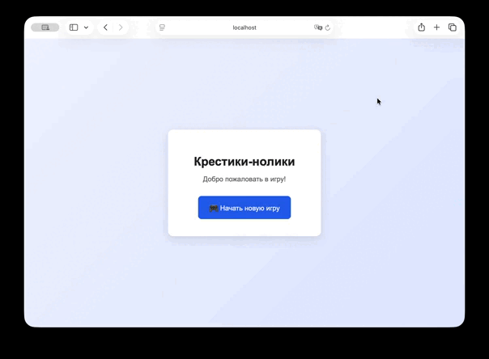

# Веб-приложение "Крестики-нолики"

## Описание проекта

Веб-приложение **«Крестики-нолики»**, реализованное на языке **Java** с использованием фреймворка **Spring**.  
Проект демонстрирует основы построения веб-приложений, работу со слоями архитектуры и алгоритм **Минимакс**.

---

---

## Архитектура

Приложение построено с чётким разделением на слои:

- **web** - взаимодействие с клиентом (REST API)
- **domain** - бизнес-логика игры
- **datasource** - хранение текущих игровых сессий
- **di** - конфигурация зависимостей Spring

Каждый слой вынесен в отдельный пакет.

---

## Domain layer

- Игровое поле представлено в виде целочисленной матрицы
- Модель текущей игры содержит:
    - `UUID`
    - игровое поле
- Реализован сервис с методами:
    - вычисление следующего хода компьютера с помощью алгоритма **Минимакс**
    - валидация игрового поля (проверка корректности ходов)
    - проверка окончания игры

Интерфейсы, модели и реализации разделены по разным файлам.

---

## Datasource layer

- Реализовано хранилище текущих игр
- Используются **потокобезопасные коллекции**
- Реализованы:
    - модели хранения
    - мапперы domain ↔ datasource
    - репозиторий для сохранения и получения игр
- Сервис domain-слоя работает через репозиторий

---

## Web layer

- Реализованы web-модели текущей игры и игрового поля
- Реализованы мапперы domain ↔ web
- REST-контроллер на Spring с методом:

